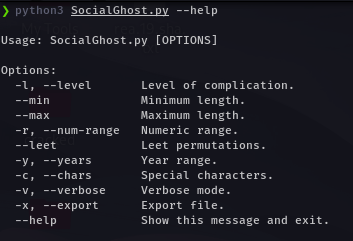
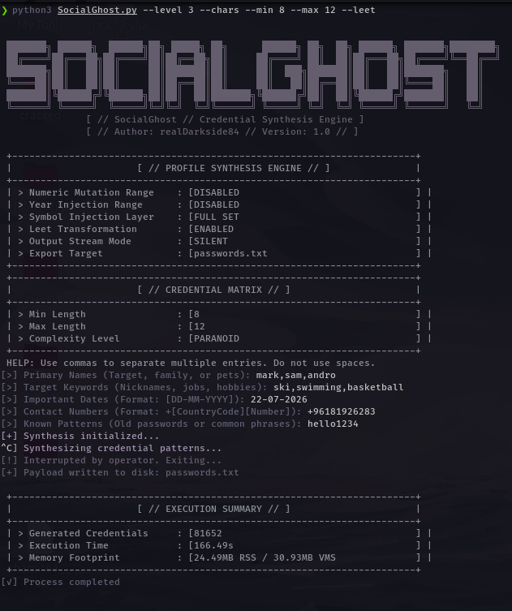

# SocialGhost
A precision credential synthesis engine that transforms target intelligence into high-probability wordlists.

---
 
## Introduction
 
SocialGhost is a specialized utility designed to map out potential credentials based on a target's personal and digital footprint. Instead of relying on massive, generic wordlists that waste time and resources, this tool uses targeted permutation logic to generate passwords a specific person is statistically likely to create.
 
Whether you are performing an authorized penetration test or an educational security audit, SocialGhost helps you move away from "brute force" and toward "intelligent synthesis" by leveraging the common patterns humans use when choosing passwords.
 
---
 
## Deployment & Installation
 
SocialGhost is built to be lightweight and runs on any modern OS with Python 3.8+.
 
### 1. Clone the Environment
Pull the source code from the repository to your local machine:
```bash
git clone https://github.com/realDarkside84/SocialGhost.git
```
 
### 2. Create & Activate a Virtual Environment
It is recommended to run SocialGhost inside a virtual environment to keep dependencies isolated.
 
**Create the environment:**
```bash
python3 -m venv venv
```
 
**Activate it:**
 
On Linux / macOS:
```bash
source venv/bin/activate
```
 
On Windows:
```bash
venv\Scripts\activate
```
 
You should see `(venv)` appear at the start of your terminal prompt, confirming the environment is active.
 
### 3. Initialize Dependencies
Install the necessary libraries to ensure the permutation engine runs smoothly:
```bash
pip install -r requirements.txt
```
 
### 4. Launch the Tool
Run the main script to enter the interactive setup:
```bash
python3 socialghost.py
```
 
---
 
## Usage & Core Logic

<p align="center">
  
</p>

<p align="center">
  
</p>

SocialGhost works by asking you specific questions about the target — names, dates, and keywords — and then processing that data through various **Complexity Levels**.
 
### Synthesis Complexity Levels
 
You can adjust how deep the engine goes based on the "Cyber Awareness" of your target:
 
| Level | Name | Description |
|-------|------|-------------|
| `0` | Standard | Covers the basics — swapping cases (Upper/Lower) and breaking down dates into common fragments. |
| `1` | Expanded | Adds string reversals (e.g., `"password"` → `"drowssap"`) and modified name prefixes. |
| `2` | Credential Analysis | Specifically targets old passwords you provide, applying full transformations to them. |
| `3` | Symbol Injection | Expands the character set to include all special symbols allowed in modern password policies. |
| `4` | Non-Linear | Removes "ordered" logic to create rare mixtures, like double-dates or name-on-name combinations. |
| `5` | Nuclear | The maximum setting — generates high-entropy, complex results for the most difficult targets. |
 
### Power User Flags
 
| Flag | Description |
|------|-------------|
| `--leet` | Runs a secondary pass after the initial list is built to generate leetspeak versions (e.g., `s` → `5`, `o` → `0`). |
| `--years [YYYY]` | Useful for targets that follow a "Name+Year" pattern. Injects a range from your start year up to today. |
| `--num-range [X]` | Appends a sequential range of numbers to every string in the list. |
 
---
 
## Important Notes & Formatting
 
To avoid errors in the synthesis engine, please follow these input rules:
 
| Field | Rule | Example |
|-------|------|---------|
| Separation | Always use commas between items. No spaces. | `tony,stark,pepper` |
| Dates | Strict `DD-MM-YYYY` format required. | `01-05-1990` |
| Phone Numbers | Include `+` sign and country code. | `+961701*****` |
 
---
 
## Legal Disclaimer
 
> SocialGhost is created for **legal and ethical use only**. It is intended for security researchers, penetration testers, and educational purposes. The developer, **realDarkside84**, is not responsible for any misuse, unauthorized access, or damage caused by the use of this tool. Always ensure you have **explicit, written permission** before testing any target.
 
---
 
## Author
 
**realDarkside84**
 
- Twitter: [https://twitter.com/Dark_side84](https://twitter.com/Dark_side84)
- Check out my blog: [https://realdarkside84.github.io/](https://realdarkside84.github.io/)

---
 
<p align="center">
  
</p>
